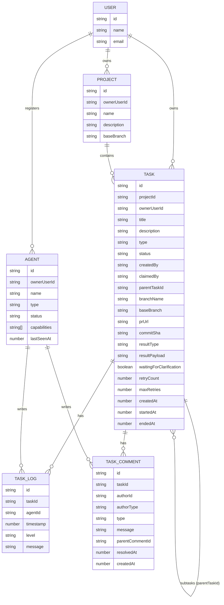

# Convex Data Model

```mermaid
erDiagram
    USER {
        string id
        string name
        string email
    }

    PROJECT {
        string id
        string ownerUserId
        string name
        string description
        string baseBranch
    }

    AGENT {
        string id
        string ownerUserId
        string name
        string type
        string status
        string[] capabilities
        number lastSeenAt
    }

    TASK {
        string id
        string projectId
        string ownerUserId
        string title
        string description
        string type
        string status
        string createdBy
        string claimedBy
        string parentTaskId
        string branchName
        string baseBranch
        string prUrl
        string commitSha
        string resultType
        string resultPayload
        boolean waitingForClarification
        number retryCount
        number maxRetries
        number createdAt
        number startedAt
        number endedAt
    }

    TASK_LOG {
        string id
        string taskId
        string agentId
        number timestamp
        string level
        string message
    }

    TASK_COMMENT {
        string id
        string taskId
        string authorId
        string authorType
        string type
        string message
        string parentCommentId
        number resolvedAt
        number createdAt
    }

    USER ||--o{ PROJECT : owns
    USER ||--o{ AGENT : registers
    USER ||--o{ TASK : owns
    PROJECT ||--o{ TASK : contains
    TASK ||--o{ TASK : "subtasks (parentTaskId)"
    TASK ||--o{ TASK_LOG : has
    TASK ||--o{ TASK_COMMENT : has
    AGENT ||--o{ TASK_LOG : writes
    AGENT ||--o{ TASK_COMMENT : writes
```
